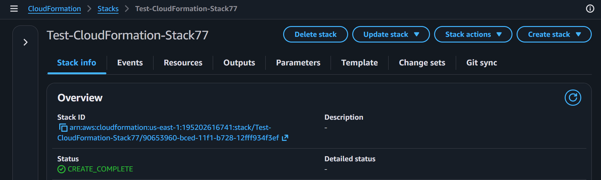
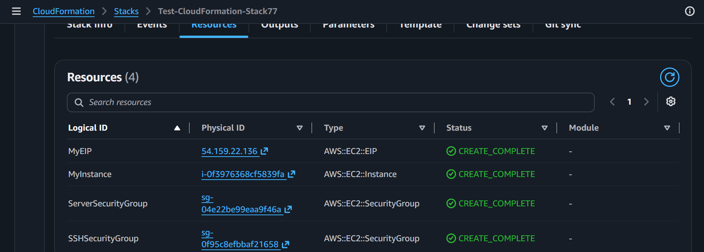
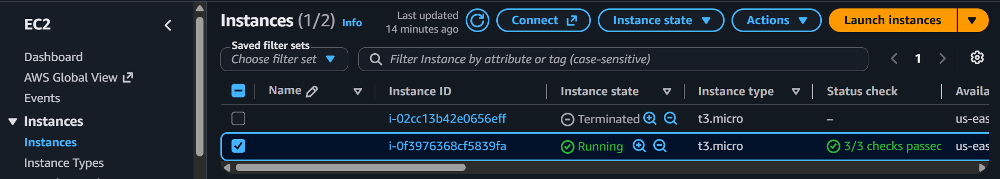
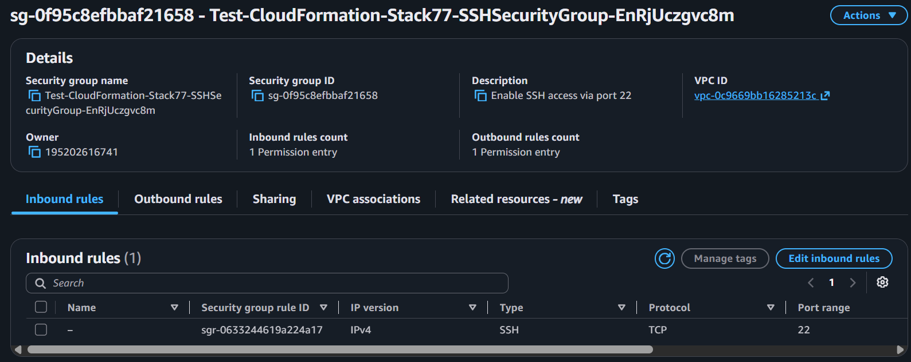
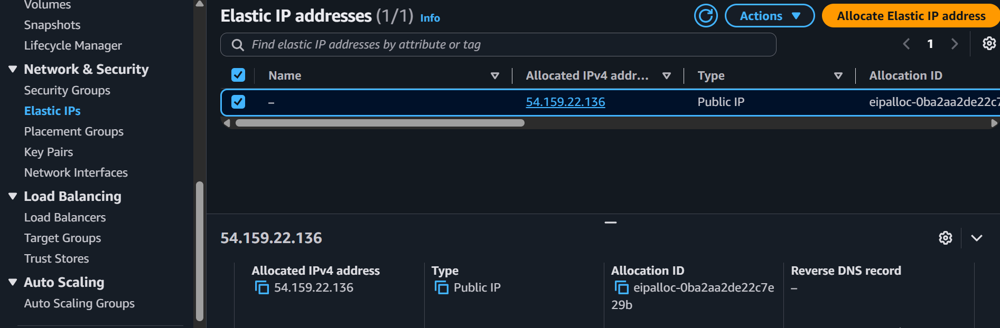
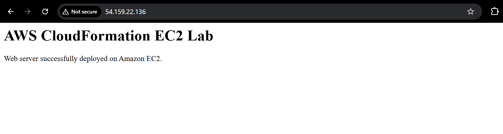
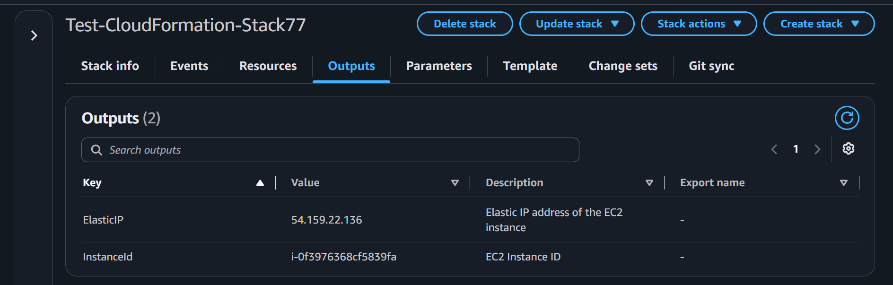

# AWS CloudFormation EC2 Web Server Lab

A hands-on AWS project demonstrating how to provision and deploy an EC2 web server using AWS CloudFormation and Infrastructure as Code (IaC).

## Project Overview

In this lab, I used AWS CloudFormation to provision an EC2-based web server infrastructure and then deployed a simple Apache web server on the instance.

The infrastructure was created and managed through a CloudFormation template instead of creating each resource manually through the AWS Console.

## AWS Resources

The CloudFormation stack creates:

* Amazon EC2 Instance
* SSH Security Group
* Web Server Security Group
* Elastic IP
* VPC-based configuration

## Architecture

```text
Internet
   |
   v
Elastic IP
   |
   v
EC2 Instance
   |
   v
Security Groups
   |
   v
Apache Web Server
   |
   v
Web Page
```

## CloudFormation

The infrastructure is defined in:

`cloudformation.yaml`

The template demonstrates:

* CloudFormation Parameters
* `!Ref`
* `!GetAtt`
* EC2 configuration
* Security Group configuration
* Elastic IP association
* CloudFormation Outputs

## Web Server Deployment

After the EC2 instance was successfully created, I connected to the instance using EC2 Instance Connect and installed Apache:

```bash
sudo dnf update -y
sudo dnf install -y httpd
sudo systemctl start httpd
sudo systemctl enable httpd
```

I then deployed a custom HTML page:

```bash
echo "<h1>AWS CloudFormation EC2 Lab</h1><p>Web server successfully deployed on Amazon EC2.</p>" | sudo tee /var/www/html/index.html
```

The application was accessed through the Elastic IP using HTTP.

## Security Configuration

The Security Groups were configured to allow:

* HTTP traffic on port 80
* SSH traffic on port 22

This allowed the web server to be accessed from the internet and the EC2 instance to be managed through EC2 Instance Connect.

## CloudFormation Outputs

The stack exposes:

* EC2 Instance ID
* Elastic IP address

This makes important deployment information available directly from the CloudFormation console.

## Troubleshooting

During the lab, I worked through several real AWS deployment issues, including:

* Default VPC configuration
* EC2 instance type compatibility
* VPC Security Group configuration
* CloudFormation resource dependencies
* Circular dependency between resources
* Updating an existing CloudFormation stack

These issues helped me understand how CloudFormation resources depend on each other and how infrastructure configuration affects deployment.

## Project Result

The CloudFormation stack successfully provisioned the EC2 infrastructure, configured the required Security Groups, associated an Elastic IP, and hosted a working Apache web server accessible through the internet.

## Technologies

* AWS CloudFormation
* Amazon EC2
* Amazon VPC
* AWS Security Groups
* Elastic IP
* Apache HTTP Server
* YAML

## Screenshots

### 1. CloudFormation Stack



### 2. CloudFormation Resources



### 3. EC2 Instance



### 4. Security Groups



### 5. Elastic IP



### 6. Web Server



### 7. CloudFormation Outputs


